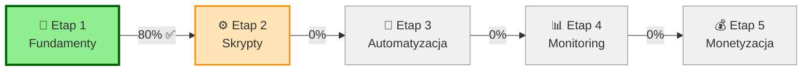
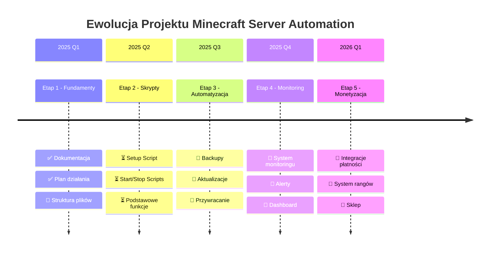

<div align="center">

# 🎮 Minecraft Server Automation

### ⚡ PowerShell Omega Scripts dla Profesjonalnego Zarządzania Serwerem Minecraft


[](https://github.com/PowerShell/PowerShell)
[](https://adoptium.net/)
[](https://www.minecraft.net/)
[](COPYRIGHT.md)

[](PLAN_DZIAŁANIA.md)
[](https://github.com/hetwerk1943/Minecraft-Server-Automation/issues)
[](https://github.com/hetwerk1943/Minecraft-Server-Automation/stargazers)
[](https://github.com/hetwerk1943/Minecraft-Server-Automation/network/members)

[📖 Dokumentacja](#-dokumentacja) • [🚀 Szybki Start](QUICK_START.md) • [💡 FAQ](#-faq) • [🐛 Zgłoś Problem](https://github.com/hetwerk1943/Minecraft-Server-Automation/issues)

---

### 🌟 Automatyzacja, która naprawdę działa!

</div>

## 📋 Spis Treści

- [O Projekcie](#-o-projekcie)
- [Status Projektu](#-status-projektu)
- [Funkcje](#-funkcje)
- [Wymagania](#-wymagania)
- [Dokumentacja](#-dokumentacja)
- [Wsparcie](#-wsparcie)
- [Licencja](#-licencja)

---

## 🎯 O Projekcie

<table>
<tr>
<td width="60%">

**Minecraft Server Automation** to **rewolucyjny** zestaw skryptów PowerShell, który **zmienia sposób** zarządzania serwerami Minecraft!

### 💎 Dlaczego Warto?

<table>
<tr><td>🚀</td><td><b>Błyskawiczna Instalacja</b><br/>Jeden skrypt - pełna konfiguracja w 5 minut!</td></tr>
<tr><td>🤖</td><td><b>Inteligentna Automatyzacja</b><br/>Backupy, aktualizacje, monitoring - wszystko działa samo</td></tr>
<tr><td>🌍</td><td><b>Prawdziwy Cross-Platform</b><br/>Windows, Linux, macOS - jeden kod dla wszystkich</td></tr>
<tr><td>🛡️</td><td><b>Bezpieczeństwo na Pierwszym Miejscu</b><br/>Automatyczne backupy przed każdą zmianą</td></tr>
<tr><td>📊</td><td><b>Profesjonalny Monitoring</b><br/>CPU, RAM, TPS, gracze - masz wszystko pod kontrolą</td></tr>
<tr><td>🎨</td><td><b>Przyjazny Interface</b><br/>Kolorowe logi, jasne komunikaty, polska dokumentacja</td></tr>
</table>

</td>
<td width="40%">

```powershell
# 🎯 To naprawdę takie proste!

# 1️⃣ Instalacja
.\scripts\MinecraftServerSetup.ps1

# 2️⃣ Uruchomienie
.\scripts\StartServer.ps1 -MaxMemory 4096

# 3️⃣ Backup
.\scripts\BackupServer.ps1

# ✅ Gotowe! Twój serwer działa!
```

<div align="center">

### 🔥 Funkcje Premium 🔥


</div>

</td>
</tr>
</table>  

---

<div align="center">

## 🆚 Dlaczego MY a nie inne rozwiązania?

<table width="100%">
<tr>
<th width="25%">Funkcja</th>
<th width="25%">🎮 Nasz Projekt</th>
<th width="25%">🔧 Ręczne Zarządzanie</th>
<th width="25%">💰 Komercyjne Panele</th>
</tr>
<tr>
<td><b>Instalacja</b></td>
<td>✅ 5 minut<br/>🤖 Automatyczna</td>
<td>❌ 30-60 min<br/>📚 Wymaga wiedzy</td>
<td>⚠️ 10-20 min<br/>💵 Płatna subskrypcja</td>
</tr>
<tr>
<td><b>Backupy</b></td>
<td>✅ Automatyczne<br/>🔄 Z rotacją</td>
<td>❌ Ręczne<br/>⏰ Trzeba pamiętać</td>
<td>✅ Automatyczne<br/>💵 Limit miejsca</td>
</tr>
<tr>
<td><b>Aktualizacje</b></td>
<td>✅ Bezpieczne<br/>↩️ Auto rollback</td>
<td>⚠️ Ryzykowne<br/>🤞 Bez zabezpieczeń</td>
<td>✅ Automatyczne<br/>💵 Premium feature</td>
</tr>
<tr>
<td><b>Cross-Platform</b></td>
<td>✅ Win/Linux/Mac<br/>🌍 Wszędzie działa</td>
<td>⚠️ Zależy od OS<br/>📝 Różne instrukcje</td>
<td>⚠️ Ograniczone<br/>🖥️ Tylko serwer</td>
</tr>
<tr>
<td><b>Koszt</b></td>
<td>✅ 100% Darmowy<br/>🎉 Open concept</td>
<td>✅ Darmowy<br/>⏰ Kosztuje czas</td>
<td>❌ $5-50/mc<br/>💸 Subskrypcja</td>
</tr>
<tr>
<td><b>Dokumentacja</b></td>
<td>✅ 2000+ linii<br/>🇵🇱 Po polsku!</td>
<td>⚠️ Google/Forum<br/>🌐 Fragmentaryczna</td>
<td>⚠️ Podstawowa<br/>🇬🇧 Po angielsku</td>
</tr>
</table>

### 🎯 Nasza Przewaga: **Automatyzacja + Bezpieczeństwo + Polski Support!**

</div>

---

## 🚧 Status Projektu

<div align="center">

### 🎯 Projekt w Aktywnym Rozwoju!



</div>

<table width="100%">
<tr>
<td width="50%">

### 📚 Dokumentacja

| Dokument | Status | Linie Kodu |
|----------|--------|------------|
| 📖 [PLAN_DZIAŁANIA.md](PLAN_DZIAŁANIA.md) | ✅ Kompletny | 467 linii |
| 🔧 [TROUBLESHOOTING.md](TROUBLESHOOTING.md) | ✅ Kompletny | 635 linii |
| 🚀 [QUICK_START.md](QUICK_START.md) | ✅ Kompletny | 580 linii |

**Łącznie:** 2085 linii dokumentacji! 📝

</td>
<td width="50%">

### ✅ Aktualny Etap: Fundamenty

<details open>
<summary><b>🟢 Ukończone (80%)</b></summary>

- [x] 📁 Struktura repozytorium
- [x] 🚫 Plik .gitignore
- [x] 📖 Pełna dokumentacja README
- [x] 🗺️ Plan działania
- [x] 🔧 Przewodnik troubleshooting
- [x] 🚀 Quick Start guide

</details>

<details>
<summary><b>🟡 W Trakcie (20%)</b></summary>

- [ ] 📂 Struktura katalogów
- [ ] ⚙️ Pierwsze skrypty PowerShell

</details>

</td>
</tr>
</table>

---

## ✨ Funkcje

<div align="center">

### 🎯 Co Oferujemy?

</div>

<table width="100%">
<tr>
<td width="50%" valign="top">

### 🎮 Podstawowe Funkcje

<table>
<tr>
<td width="20%">
<div align="center">

<br/><b>Instalacja</b>
</div>
</td>
<td width="80%">
<h4>⚡ Automatyczna Instalacja</h4>
Jeden klik i gotowe! Skrypt pobiera Java, server.jar, konfiguruje wszystko automatycznie.
<br/>
<code>✅ Java ✅ Server ✅ Konfiguracja ✅ EULA</code>
</td>
</tr>

<tr>
<td>
<div align="center">

<br/><b>Zarządzanie</b>
</div>
</td>
<td>
<h4>▶️ Inteligentne Zarządzanie</h4>
Start, stop, restart z graceful shutdown. Serwer zatrzymuje się bezpiecznie, zapisując wszystko.
<br/>
<code>🟢 Start 🔴 Stop 🔄 Restart</code>
</td>
</tr>

<tr>
<td>
<div align="center">

<br/><b>Backupy</b>
</div>
</td>
<td>
<h4>💾 System Kopii Zapasowych</h4>
Automatyczne backupy z rotacją. Nigdy nie stracisz swojego świata!
<br/>
<code>📦 Kompresja 🔄 Rotacja ✅ Weryfikacja</code>
</td>
</tr>

<tr>
<td>
<div align="center">

<br/><b>Aktualizacje</b>
</div>
</td>
<td>
<h4>🔄 Bezpieczne Aktualizacje</h4>
Automatyczny backup przed aktualizacją. Coś poszło nie tak? Rollback w sekundę!
<br/>
<code>📥 Download 💾 Backup ↩️ Rollback</code>
</td>
</tr>

<tr>
<td>
<div align="center">

<br/><b>Monitoring</b>
</div>
</td>
<td>
<h4>📊 Real-time Monitoring</h4>
Śledź wydajność na żywo: CPU, RAM, TPS, liczba graczy.
<br/>
<code>🖥️ CPU 💾 RAM ⚡ TPS 👥 Gracze</code>
</td>
</tr>
</table>

</td>
<td width="50%" valign="top">

### 🚀 Zaawansowane Funkcje

<table>
<tr>
<td width="20%">
<div align="center">

<br/><b>Alerty</b>
</div>
</td>
<td width="80%">
<h4>🔔 System Alertów</h4>
Powiadomienia o problemach przez email lub webhook. Zawsze wiesz co się dzieje!
<br/>
<code>📧 Email 🔗 Webhook 📱 SMS</code>
</td>
</tr>

<tr>
<td>
<div align="center">

<br/><b>Logi</b>
</div>
</td>
<td>
<h4>📝 Strukturalne Logowanie</h4>
Wszystkie operacje logowane z rotacją. Łatwo znajdziesz problemy!
<br/>
<code>📊 Poziomy 🔄 Rotacja 🔍 Łatwe przeszukiwanie</code>
</td>
</tr>

<tr>
<td>
<div align="center">

<br/><b>Bezpieczeństwo</b>
</div>
</td>
<td>
<h4>🛡️ Weryfikacja i Bezpieczeństwo</h4>
Weryfikacja integralności backupów, safe mode, automatyczne testy.
<br/>
<code>✅ Weryfikacja 🔒 Szyfrowanie 🧪 Testy</code>
</td>
</tr>

<tr>
<td>
<div align="center">

<br/><b>Cross-Platform</b>
</div>
</td>
<td>
<h4>🌐 Prawdziwy Multi-Platform</h4>
Jeden kod działa wszędzie: Windows, Linux, macOS.
<br/>
<code>🪟 Windows 🐧 Linux 🍎 macOS</code>
</td>
</tr>

<tr>
<td>
<div align="center">

<br/><b>Monetyzacja</b>
</div>
</td>
<td>
<h4>💰 System Monetyzacji</h4>
<i>(Przyszła wersja)</i><br/>
Integracje z płatnościami, rangi, sklep - zarabiaj na serwerze!
<br/>
<code>💳 Płatności 👑 Rangi 🛒 Sklep</code>
</td>
</tr>
</table>

</td>
</tr>
</table>

<div align="center">

### 📖 [Zobacz Pełny Plan Funkcji →](PLAN_DZIAŁANIA.md)

</div>

---

## 🔧 Wymagania

### Minimalne Wymagania Systemowe

| Komponent | Minimum | Zalecane |
|-----------|---------|----------|
| **System Operacyjny** | Windows 10, Ubuntu 20.04, macOS 10.15 | Windows 11, Ubuntu 22.04, macOS 12+ |
| **PowerShell** | 7.0 | 7.4+ |
| **Java** | JDK 17 | JDK 21 |
| **RAM** | 2GB | 4GB+ |
| **Dysk** | 5GB wolnego miejsca | 20GB+ (dla backupów) |
| **Sieć** | Port 25565 | Stabilne łącze |

### Instalacja Wymagań

#### Windows
```powershell
# PowerShell 7
winget install Microsoft.PowerShell

# Java 17+
winget install EclipseAdoptium.Temurin.17.JDK
```

#### Linux (Ubuntu/Debian)
```bash
# PowerShell 7 (sprawdź najnowszą wersję na https://github.com/PowerShell/PowerShell/releases)
wget https://github.com/PowerShell/PowerShell/releases/download/v7.4.0/powershell_7.4.0-1.deb_amd64.deb
sudo dpkg -i powershell_7.4.0-1.deb_amd64.deb

# Java 17+
sudo apt update
sudo apt install openjdk-17-jdk
```

#### macOS
```bash
# PowerShell 7
brew install powershell

# Java 17+
brew install openjdk@17
```

### Weryfikacja Instalacji
```powershell
# Sprawdź PowerShell
$PSVersionTable.PSVersion

# Sprawdź Java
java -version
```

---

## 📚 Dokumentacja

### Główne Dokumenty

| Dokument | Opis |
|----------|------|
| **[README.md](README.md)** | Ten dokument - ogólne informacje o projekcie |
| **[PLAN_DZIAŁANIA.md](PLAN_DZIAŁANIA.md)** | Kompleksowy plan rozwoju z przewidywanymi problemami |
| **[TROUBLESHOOTING.md](TROUBLESHOOTING.md)** | Przewodnik rozwiązywania problemów krok po kroku |
| **[QUICK_START.md](QUICK_START.md)** | Szybki start dla początkujących *(wkrótce)* |
| **[COPYRIGHT.md](COPYRIGHT.md)** | Informacje o prawach autorskich |

### Struktura Projektu (Planowana)

```
Minecraft-Server-Automation/
├── 📄 README.md                    # Główna dokumentacja
├── 📄 PLAN_DZIAŁANIA.md            # Plan rozwoju projektu
├── 📄 TROUBLESHOOTING.md           # Rozwiązywanie problemów
├── 📄 QUICK_START.md               # Szybki start
├── 📄 COPYRIGHT.md                 # Prawa autorskie
├── 📄 .gitignore                   # Wykluczenia Git
├── 📁 config/                      # Pliki konfiguracyjne
│   ├── server.properties.template
│   ├── backup-config.json
│   └── monetization-config.json
├── 📁 scripts/                     # Główne skrypty PowerShell
│   ├── MinecraftServerSetup.ps1   # Instalacja
│   ├── StartServer.ps1            # Uruchamianie
│   ├── StopServer.ps1             # Zatrzymywanie
│   ├── BackupServer.ps1           # Backupy
│   ├── UpdateServer.ps1           # Aktualizacje
│   ├── MonitorServer.ps1          # Monitoring
│   └── RestoreBackup.ps1          # Przywracanie
├── 📁 logs/                        # Logi (ignorowane)
├── 📁 backups/                     # Kopie zapasowe (ignorowane)
└── 📁 tests/                       # Testy
    └── Test-Scripts.ps1
```

---

## 🚀 Szybki Start (Gdy skrypty będą gotowe)

### 1. Sklonuj Repozytorium
```bash
git clone https://github.com/hetwerk1943/Minecraft-Server-Automation.git
cd Minecraft-Server-Automation
```

### 2. Instalacja Serwera (Przyszłość)
```powershell
# Automatyczna instalacja i konfiguracja
.\scripts\MinecraftServerSetup.ps1
```

### 3. Uruchomienie Serwera (Przyszłość)
```powershell
# Start serwera z 4GB RAM
.\scripts\StartServer.ps1 -MaxMemory 4096
```

### 4. Zarządzanie (Przyszłość)
```powershell
# Backup
.\scripts\BackupServer.ps1

# Aktualizacja
.\scripts\UpdateServer.ps1

# Stop
.\scripts\StopServer.ps1
```

---

## 🎓 Dla Kontrybutorów

Chcesz pomóc w rozwoju projektu? Świetnie! 

### Jak zacząć?

1. **Przeczytaj dokumentację:**
   - [PLAN_DZIAŁANIA.md](PLAN_DZIAŁANIA.md) - zobacz co jest do zrobienia
   - [TROUBLESHOOTING.md](TROUBLESHOOTING.md) - poznaj częste problemy

2. **Zapoznaj się z konwencjami:**
   - Kod PowerShell zgodny ze standardami
   - Komentarze i dokumentacja w języku polskim
   - Obsługa błędów przez try-catch
   - Cross-platform path handling

3. **Wybierz zadanie:**
   - Zobacz otwarte Issues
   - Sprawdź TODO w PLAN_DZIAŁANIA.md
   - Zaproponuj nowe funkcje

4. **Twórz zgodnie ze standardami:**
```powershell
# Przykładowa struktura skryptu
param(
    [int]$MaxMemory = 2048
)

function Write-ColorMessage {
    param([string]$Message, [string]$Color = "White")
    Write-Host $Message -ForegroundColor $Color
}

try {
    # Główna logika
    Write-ColorMessage "Wykonuję operację..." "Green"
    
} catch {
    Write-ColorMessage "Błąd: $_" "Red"
    exit 1
}
```

---

## 🐛 Zgłaszanie Problemów

Znalazłeś bug? Masz sugestię? 

1. **Sprawdź istniejące Issues** - może problem już jest zgłoszony
2. **Przeczytaj [TROUBLESHOOTING.md](TROUBLESHOOTING.md)** - może znajdziesz rozwiązanie
3. **Utwórz nowy Issue** - używając szablonu z TROUBLESHOOTING.md

### Co powinno zawierać zgłoszenie?
- Opis problemu
- Kroki do reprodukcji
- Oczekiwane vs rzeczywiste zachowanie
- Środowisko (OS, PowerShell, Java)
- Relevantne logi

---

## 💡 FAQ

### Dlaczego PowerShell?
PowerShell Core jest cross-platform, ma doskonałe wsparcie dla automatyzacji, i jest łatwy w nauce. Skrypty działają identycznie na Windows, Linux i macOS.

### Czy mogę używać tego komercyjnie?
Zobacz [COPYRIGHT.md](COPYRIGHT.md) - wszystkie prawa zastrzeżone. Skontaktuj się z autorem w sprawie licencji komercyjnej.

### Czy wspieracie pluginy/mody?
Tak! Skrypty są kompatybilne z Vanilla, Spigot, Paper, Purpur i innymi implementacjami. Pluginy działają normalnie.

### Czy to działa z Bedrock Edition?
Obecnie projekt skupia się na Java Edition. Bedrock może być dodany w przyszłości.

### Jak często robić backupy?
Zalecamy:
- Małe serwery (1-5 graczy): codziennie
- Średnie serwery (5-20 graczy): 2x dziennie
- Duże serwery (20+ graczy): co 4-6 godzin

### Ile pamięci RAM potrzebuję?
- Vanilla (1-5 graczy): 2GB
- Vanilla (5-10 graczy): 4GB
- Z pluginami: +1-2GB
- Z modami: +2-4GB

---

## 📞 Wsparcie

### Potrzebujesz pomocy?

1. **Dokumentacja:**
   - [TROUBLESHOOTING.md](TROUBLESHOOTING.md) - rozwiązywanie problemów
   - [PLAN_DZIAŁANIA.md](PLAN_DZIAŁANIA.md) - szczegółowe informacje

2. **Community:**
   - GitHub Issues - pytania i dyskusje
   - GitHub Discussions - pomysły i feedback

3. **Kontakt bezpośredni:**
   - **Email:** hetwerk1943@gmail.com
   - **GitHub:** [@hetwerk1943](https://github.com/hetwerk1943)

---

## 🙏 Podziękowania

Projekt inspirowany przez społeczność adminów serwerów Minecraft i potrzebę prostszej automatyzacji.

Specjalne podziękowania dla:
- Społeczności PowerShell
- Deweloperów Paper/Spigot
- Wszystkich kontrybutorów

---

## 📄 Licencja

**© 2025 Dominik Opałka. All Rights Reserved.**

Ten projekt jest własnością prywatną. Wszystkie prawa zastrzeżone.  
Zobacz [COPYRIGHT.md](COPYRIGHT.md) dla pełnych informacji.

**Kontakt w sprawie licencji:** hetwerk1943@gmail.com

---

## 🗺️ Roadmap

<div align="center">

### 🎯 Mapa Drogowa Projektu



</div>

<br/>

<table width="100%">
<tr>
<td width="20%" align="center">

### ✅ Etap 1
**Fundamenty**


**Status:** 80% 🟢

</td>
<td width="20%" align="center">

### 🚧 Etap 2
**Skrypty**


**Status:** 0% 🟡

</td>
<td width="20%" align="center">

### 📋 Etap 3
**Automatyzacja**


**Status:** 0% ⚪

</td>
<td width="20%" align="center">

### 🔮 Etap 4
**Monitoring**


**Status:** 0% ⚪

</td>
<td width="20%" align="center">

### 💰 Etap 5
**Monetyzacja**


**Status:** 0% ⚪

</td>
</tr>
</table>

<details>
<summary><h3>📖 Szczegółowy Plan Etapów (kliknij aby rozwinąć)</h3></summary>

### ✅ Etap 1: Fundamenty (80% - W TRAKCIE)
```
Ukończone:
✅ [x] Podstawowa struktura repozytorium
✅ [x] Dokumentacja i plan działania (2085 linii!)
✅ [x] Przewodnik rozwiązywania problemów

W trakcie:
⏳ [ ] Struktura katalogów (scripts/, config/, logs/)
⏳ [ ] Pierwsze skrypty testowe
```

### 🚧 Etap 2: Skrypty Podstawowe (NASTĘPNY)
```yaml
Główne zadania:
  - MinecraftServerSetup.ps1: Automatyczna instalacja
  - StartServer.ps1: Uruchamianie z zarządzaniem pamięcią
  - StopServer.ps1: Bezpieczne zatrzymywanie
  - Testy: Walidacja na Windows/Linux/macOS
```

### 📋 Etap 3: Automatyzacja Zaawansowana
```yaml
System backupów:
  - BackupServer.ps1: Automatyczne kopie zapasowe
  - UpdateServer.ps1: Bezpieczne aktualizacje
  - RestoreBackup.ps1: Przywracanie z kopii
  - Harmonogram: Cron jobs / Task Scheduler
```

### 🔮 Etap 4: Monitoring i Diagnostyka
```yaml
Monitoring:
  - MonitorServer.ps1: Real-time stats
  - System logowania: Strukturalne logi
  - Alerty: Email/Webhook/SMS
  - Dashboard: Wizualizacja metryk
```

### 💰 Etap 5: Monetyzacja (Przyszłość)
```yaml
Funkcje premium:
  - Integracje płatności: PayPal, Stripe, przelewy24
  - System rangów: VIP, Premium, Sponsor
  - Sklep: Items, rangi, komendy
  - Statystyki: Przychody, top płacący
```

</details>

---

## 📊 Status i Statystyki

<div align="center">

### 🎯 Postęp Projektu

<table>
<tr>
<td align="center" width="20%">
<br/>
<b>Dokumentacja</b><br/>
<br/>
<b>80%</b> 🟢
</td>
<td align="center" width="20%">
<br/>
<b>Skrypty</b><br/>
<br/>
<b>0%</b> 🔴
</td>
<td align="center" width="20%">
<br/>
<b>Automatyzacja</b><br/>
<br/>
<b>0%</b> 🔴
</td>
<td align="center" width="20%">
<br/>
<b>Monitoring</b><br/>
<br/>
<b>0%</b> 🔴
</td>
<td align="center" width="20%">
<br/>
<b>Testy</b><br/>
<br/>
<b>0%</b> 🔴
</td>
</tr>
</table>

### 📈 Ogólny Postęp: 15% 🟡

</div>

<br/>

<table width="100%">
<tr>
<td width="33%" align="center">

#### 📝 Linie Kodu
**2,085** linii<br/>
dokumentacji

</td>
<td width="33%" align="center">

#### 📁 Pliki
**5** plików<br/>
dokumentacji

</td>
<td width="33%" align="center">

#### 🔧 Problemy
**12** rozwiązań<br/>
w planie

</td>
</tr>
</table>

---

## 🎯 Następne Kroki

1. ✅ ~~Utworzenie podstawowej dokumentacji~~
2. ✅ ~~Stworzenie kompleksowego planu~~
3. ✅ ~~Przewodnik rozwiązywania problemów~~
4. 🔄 Utworzenie Quick Start guide
5. 📝 Rozpoczęcie implementacji skryptów
6. 🧪 Testy pierwszych skryptów

---

## 🤝 Społeczność i Wsparcie

<div align="center">

### Dołącz do Nas! 🎉

<table>
<tr>
<td align="center" width="25%">
<br/>
<b>GitHub</b><br/>
<a href="https://github.com/hetwerk1943/Minecraft-Server-Automation/issues">Issues</a> •
<a href="https://github.com/hetwerk1943/Minecraft-Server-Automation/discussions">Discussions</a>
</td>
<td align="center" width="25%">
<br/>
<b>Zostaw Gwiazdkę</b><br/>
Pokaż że Ci się podoba!<br/>
⭐ <a href="https://github.com/hetwerk1943/Minecraft-Server-Automation/stargazers">Star</a>
</td>
<td align="center" width="25%">
<br/>
<b>Fork</b><br/>
Stwórz swoją wersję!<br/>
🔱 <a href="https://github.com/hetwerk1943/Minecraft-Server-Automation/fork">Fork</a>
</td>
<td align="center" width="25%">
<br/>
<b>Kontakt</b><br/>
Masz pytania?<br/>
📧 hetwerk1943@gmail.com
</td>
</tr>
</table>

---

### 💡 Jak Możesz Pomóc?

<table width="100%">
<tr>
<td align="center" width="20%">
<br/>
<b>Koduj</b><br/>
Pomóż w rozwoju
</td>
<td align="center" width="20%">
<br/>
<b>Testuj</b><br/>
Znajdź błędy
</td>
<td align="center" width="20%">
<br/>
<b>Dokumentuj</b><br/>
Popraw docs
</td>
<td align="center" width="20%">
<br/>
<b>Dyskutuj</b><br/>
Dziel się pomysłami
</td>
<td align="center" width="20%">
<br/>
<b>Udostępnij</b><br/>
Pokaż znajomym
</td>
</tr>
</table>

</div>

---

## 🏆 Podziękowania

<div align="center">

Projekt istnieje dzięki wszystkim, którzy przyczyniają się do jego rozwoju! 🙏

### Specjalne Podziękowania

<table>
<tr>
<td align="center">
<br/>
<b>Społeczność PowerShell</b>
</td>
<td align="center">
<br/>
<b>Deweloperzy Paper/Spigot</b>
</td>
<td align="center">
<br/>
<b>Eclipse Adoptium</b>
</td>
<td align="center">
<br/>
<b>Admini Serwerów MC</b>
</td>
</tr>
</table>

</div>

---

<div align="center">

## 📜 Informacje Prawne

**© 2025 Dominik Opałka. All Rights Reserved.**

Ten projekt jest własnością prywatną. Wszystkie prawa zastrzeżone.

📄 [COPYRIGHT.md](COPYRIGHT.md) • 📧 hetwerk1943@gmail.com

---

### ⭐ Jeśli projekt Ci się podoba, zostaw gwiazdkę! ⭐


<table>
<tr>
<td align="center" width="33%">
<br/>
<b>Made with ❤️</b>
</td>
<td align="center" width="33%">
<br/>
<b>For Minecraft</b>
</td>
<td align="center" width="33%">
<br/>
<b>By Server Admins</b>
</td>
</tr>
</table>

### 🚀 Status: 🟢 Aktywny Rozwój

[](https://github.com/hetwerk1943/Minecraft-Server-Automation)

</div>
